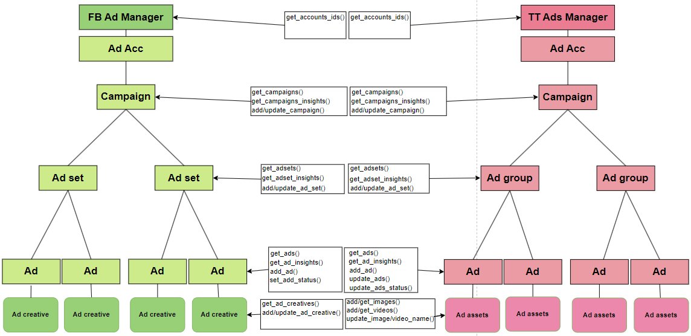

# Ads Manager

## Description 
Ads Manager serves as the extended SDK around TikTok and Facebook API with additional services to export resource details and insight reports, and manage resources. As well as, upload them to AWS S3.
The Ads Manager consists of services divided into three groups:
- **Exporter** - in charge of obtaining resource details and insight reports.
- **Importer**  - in charge of creating and updating resources.
- **Uploader**  - in charge of saving the resource details and insights to AWS S3.

Services cover following resources:
- Campaigns
- AdSets/AdGroups
- Ads
- Images
- Videos

## Setup

To install the package add the following dependency to your requirements.txt file:
```bash
ads_manager @ file://<ABSOLUTE_PATH_TO_CODE>
```

To use the package just import it in your code:

```python
from ads_manager.services.unified import importer, exporter
from ads_manager.services.facebook import importer as facebook_importer
from ads_manager.services.facebook import exporter as facebook_exporter
from ads_manager.services.tiktok import importer as tiktok_importer
from ads_manager.services.tiktok import exporter as tiktok_exporter
from ads_manager.services.uploader import s3_uploader as s3_uploader
from ads_manager import enums
```


## Usage and description
Unified services contain unified functions for both platforms, TikTok services offer specific functions for TikTok and Facebook services offer specific functions for Facebook. Uploader services offer uploading the data exported to AWS S3.

### Unified Services

The `exporter` service contains all the functions to get the resource details and resource performance.<br/><br/>
Unified resource details functions:

```python
import ads_manager.services.unified.exporter as exporter
from ads_manager import enums

exporter.get_account_ids(
    user_access_token='<USER_ACCESS_TOKEN>',  # User access token.
    platform='<PLATFORM>',  # Platform used. 'enums.Platform.TIKTOK' or 'enums.Platform.FACEBOOK' 
    params='<PARAMS>',  # Dictionary, Needed 'app_id' and 'secret' parameters only for TikTok platform.
)

exporter.get_campaigns_details(
    user_access_token='<USER_ACCESS_TOKEN>',  # User access token.
    platform='<PLATFORM>',  # Platform used. 'enums.Platform.TIKTOK' or 'enums.Platform.FACEBOOK'
    account_ids='<ACCOUNT_IDS>',  # List of account IDs
    params='<PARAMS>',  # Dictionary, set 'sandbox' to True if using a TikTok sandbox account for testing
)

exporter.get_adsets_details(
    user_access_token='<USER_ACCESS_TOKEN>',  # User access token.
    platform='<PLATFORM>',  # Platform used. 'enums.Platform.TIKTOK' or 'enums.Platform.FACEBOOK'
    account_ids='<ACCOUNT_IDS>',  # List of account IDs
    params='<PARAMS>',  # Dictionary, set 'sandbox' to True if using a TikTok sandbox account for testing
)

exporter.get_ads_details(
    user_access_token='<USER_ACCESS_TOKEN>',  # User access token.
    platform='<PLATFORM>',  # Platform used. 'enums.Platform.TIKTOK' or 'enums.Platform.FACEBOOK'
    account_ids='<ACCOUNT_IDS>',  # List of account IDs
    params='<PARAMS>',  # Dictionary, set 'sandbox' to True if using a TikTok sandbox account for testing
)
```
Unified insights report functions:

```python
import ads_manager.services.unified.exporter as exporter
from ads_manager import enums

exporter.get_campaign_insights(
    user_access_token='<USER_ACCESS_TOKEN>',  # User access token.
    platform='<PLATFORM>',  # Platform used. 'enums.Platform.TIKTOK' or 'enums.Platform.FACEBOOK'
    account_ids='<ACCOUNT_IDS>',  # List of account IDs
    date_from='<DATE_FROM>',  # The time range from which the data should be included (ex. datetime.datetime(2023, 7, 25))
    date_to='<DATE_TO>',  # The time range to which the data should be included (ex. datetime.datetime(2023, 7, 25))
    params='<PARAMS>',  # Dictionary, set 'sandbox' to True if using a TikTok sandbox account for testing
)

exporter.get_adset_insights(
    user_access_token='<USER_ACCESS_TOKEN>',  # User access token.
    platform='<PLATFORM>',  # Platform used. 'enums.Platform.TIKTOK' or 'enums.Platform.FACEBOOK'
    account_ids='<ACCOUNT_IDS>',  # List of account IDs
    date_from='<DATE_FROM>',  # The time range from which the data should be included (ex. datetime.datetime(2023, 7, 25))
    date_to='<DATE_TO>',  # The time range to which the data should be included (ex. datetime.datetime(2023, 7, 25))
    params='<PARAMS>',  # Dictionary, set 'sandbox' to True if using a TikTok sandbox account for testing
)

exporter.get_ad_insights(
    user_access_token='<USER_ACCESS_TOKEN>',  # User access token.
    platform='<PLATFORM>',  # Platform used. 'enums.Platform.TIKTOK' or 'enums.Platform.FACEBOOK'
    account_ids='<ACCOUNT_IDS>',  # List of account IDs
    date_from='<DATE_FROM>',  # The time range from which the data should be included (ex. datetime.datetime(2023, 7, 25))
    date_to='<DATE_TO>',  # The time range to which the data should be included (ex. datetime.datetime(2023, 7, 25))
    params='<PARAMS>',  # Dictionary, set 'sandbox' to True if using a TikTok sandbox account for testing
)

exporter.get_insights_by_resource_type(
    user_access_token='<USER_ACCESS_TOKEN>',  # User access token.
    platform='<PLATFORM>',  # Platform used. 'enums.Platform.TIKTOK' or 'enums.Platform.FACEBOOK'
    resource_type='<RESOURCE_TYPE>',  # Resource type. 'enums.ResourceType.CAMPAIGN, enums.ResourceType.AD_SET or enums.ResourceType.AD
    account_ids='<ACCOUNT_IDS>',  # List of account IDs
    date_from='<DATE_FROM>',  # The time range from which the data should be included (ex. datetime.datetime(2023, 7, 25))
    date_to='<DATE_TO>',  # The time range to which the data should be included (ex. datetime.datetime(2023, 7, 25))
    params='<PARAMS>',  # Dictionary, set 'sandbox' to True if using a TikTok sandbox account for testing
)
```
<br/>

The `importer` service contains all the functions to create and update resources.<br/><br/>
Unified create resource functions:

```python
import ads_manager.services.unified.importer as importer
from ads_manager import enums

importer.create_campaign(
    user_access_token='<USER_ACCESS_TOKEN>',  # User access token.
    ad_account_id='<AD_ACCOUNT_ID>',  # Ad account ID to create at
    platform='<PLATFORM>',  # Platform used. 'enums.Platform.TIKTOK' or 'enums.Platform.FACEBOOK'
    campaign_details='<CAMPAIGN_DETAILS>',  # Details of the campaign to be created - fields defined in https://ads.tiktok.com/marketing_api/docs?id=1739318962329602 or https://developers.facebook.com/docs/marketing-api/reference/adgroup/v17.0
    params='<PARAMS>'  # Dictionary, set 'sandbox' to True if using a TikTok sandbox account for testing
)

importer.create_ad_set(
    user_access_token='<USER_ACCESS_TOKEN>',  # User access token.
    ad_account_id='<AD_ACCOUNT_ID>',  # Ad account ID to create at
    platform='<PLATFORM>',  # Platform used. 'enums.Platform.TIKTOK' or 'enums.Platform.FACEBOOK'
    adset_details='<ADSET_DETAILS>',  # Details of the ad set to be created - # Details of the adgroup to be created - fields defined in https://ads.tiktok.com/marketing_api/docs?id=1739499616346114 or https://developers.facebook.com/docs/marketing-api/reference/adgroup/v17.0
    params='<PARAMS>'  # Dictionary, set 'sandbox' to True if using a TikTok sandbox account for testing
)

importer.create_ads(
    user_access_token='<USER_ACCESS_TOKEN>',  # User access token.
    ad_account_id='<AD_ACCOUNT_ID>',  # Ad account ID to create at
    platform='<PLATFORM>',  # Platform used. 'enums.Platform.TIKTOK' or 'enums.Platform.FACEBOOK'
    ads_details='<ADS_DETAILS>',  # Details of the ads to be created - fields defined in https://ads.tiktok.com/marketing_api/docs?id=1739953377508354 or https://developers.facebook.com/docs/marketing-api/reference/adgroup/v17.0
    params='<PARAMS>'  # Dictionary, set 'sandbox' to True if using a TikTok sandbox account for testing
)
```
Unified update resource functions:

```python
import ads_manager.services.unified.importer as importer
from ads_manager import enums

importer.update_campaign(
    user_access_token='<USER_ACCESS_TOKEN>',  # User access token.
    ad_account_id='<AD_ACCOUNT_ID>',  # Ad account ID to create at
    platform='<PLATFORM>',  # Platform used. 'enums.Platform.TIKTOK' or 'enums.Platform.FACEBOOK'
    campaign_id='<CAMPAIGN_ID>',  # Campaign ID
    campaign_details='<CAMPAIGN_DETAILS>',  # Details of the campaign to be updated - fields defined in https://ads.tiktok.com/marketing_api/docs?id=1739318962329602 or https://developers.facebook.com/docs/marketing-api/reference/adgroup/v17.0
    params='<PARAMS>'  # Dictionary, set 'sandbox' to True if using a TikTok sandbox account for testing
)

importer.update_ad_set(
    user_access_token='<USER_ACCESS_TOKEN>',  # User access token.
    ad_account_id='<AD_ACCOUNT_ID>',  # Ad account ID to create at
    platform='<PLATFORM>',  # Platform used. 'enums.Platform.TIKTOK' or 'enums.Platform.FACEBOOK'
    adset_id='<ADSET_ID>',  # Adset ID
    adset_details='<ADSET_DETAILS>',  # Details of the ad set to be updated - # Details of the adgroup to be created - fields defined in https://ads.tiktok.com/marketing_api/docs?id=1739499616346114 or https://developers.facebook.com/docs/marketing-api/reference/adgroup/v17.0
    params='<PARAMS>'  # Dictionary, set 'sandbox' to True if using a TikTok sandbox account for testing
)
```
<br/>

### Facebook Services

The `exporter` service contains all the functions to get the resource details and resource performance for Facebook.<br/><br/>
Facebook resource details functions:

```python
import ads_manager.services.facebook.exporter as facebook_exporter

facebook_exporter.get_account_ids(
    user_access_token='<USER_ACCESS_TOKEN>',  # User access token
)

facebook_exporter.get_campaigns_details(
    user_access_token='<USER_ACCESS_TOKEN>',  # User access token
    account_ids='<ACCOUNT_IDS>',  # List of account IDs
)

facebook_exporter.get_adsets_details(
    user_access_token='<USER_ACCESS_TOKEN>',  # User access token
    account_ids='<ACCOUNT_IDS>',  # List of account IDs
)

facebook_exporter.get_ads_details(
    user_access_token='<USER_ACCESS_TOKEN>',  # User access token
    account_ids='<ACCOUNT_IDS>',  # List of account IDs
)
```
Facebook insights report functions:

```python
import ads_manager.services.facebook.exporter as facebook_exporter

facebook_exporter.get_campaign_insights(
    user_access_token='<USER_ACCESS_TOKEN>',  # User access token
    account_ids='<ACCOUNT_IDS>',  # List of account IDs
    date_from='<DATE_FROM>',  # The time range from which the data should be included (ex. datetime.datetime(2023, 7, 25))
    date_to='<DATE_TO>'  # The time range to which the data should be included (ex. datetime.datetime(2023, 7, 25))
)

facebook_exporter.get_adset_insights(
    user_access_token='<USER_ACCESS_TOKEN>',  # User access token
    account_ids='<ACCOUNT_IDS>',  # List of account IDs
    date_from='<DATE_FROM>',  # The time range from which the data should be included (ex. datetime.datetime(2023, 7, 25))
    date_to='<DATE_TO>'  # The time range to which the data should be included (ex. datetime.datetime(2023, 7, 25))
)

facebook_exporter.get_ad_insights(
    user_access_token='<USER_ACCESS_TOKEN>',  # User access token
    account_ids='<ACCOUNT_IDS>',  # List of account IDs
    date_from='<DATE_FROM>',  # The time range from which the data should be included (ex. datetime.datetime(2023, 7, 25))
    date_to='<DATE_TO>'  # The time range to which the data should be included (ex. datetime.datetime(2023, 7, 25))
)

facebook_exporter.get_ad_creatives_list(
    user_access_token='<USER_ACCESS_TOKEN>',  # User access token
    account_ids='<ACCOUNT_IDS>',  # List of account IDs
)

facebook_exporter.get_ad_creatives(
    user_access_token='<USER_ACCESS_TOKEN>',  # User access token
    account_ids='<ACCOUNT_IDS>',  # List of account IDs
    asset_ids='<ASSET_IDS>',  # List of asset IDs
)
```

<br/>

The `importer` service contains all the functions to create and update Facebook resources.<br/><br/>
Facebook create resource functions:

```python
import ads_manager.services.facebook.importer as facebook_importer

facebook_importer.create_campaign(
    user_access_token='<USER_ACCESS_TOKEN>',  # User access token.
    ad_account_id='<AD_ACCOUNT_ID>',  # Ad account ID to create at
    campaign_details='<CAMPAIGN_DETAILS>',  # Details of the campaign to be created - fields defined in https://developers.facebook.com/docs/marketing-api/reference/adgroup/v17.0
)

facebook_importer.create_ad_set(
    user_access_token='<USER_ACCESS_TOKEN>',  # User access token.
    ad_account_id='<AD_ACCOUNT_ID>',  # Ad account ID to create at
    adset_details='<ADSET_DETAILS>'  # Details of the ad set to be created - # Details of the adgroup to be created - fields defined in https://developers.facebook.com/docs/marketing-api/reference/adgroup/v17.0
)

facebook_importer.create_ads(
    user_access_token='<USER_ACCESS_TOKEN>',  # User access token.
    ad_account_id='<AD_ACCOUNT_ID>',  # Ad account ID to create at
    ads_details='<ADS_DETAILS>'  # Details of the ads to be created - fields defined in https://developers.facebook.com/docs/marketing-api/reference/adgroup/v17.0
)

facebook_importer.create_ad_creative(
    user_access_token='<USER_ACCESS_TOKEN>',  # User access token.
    ad_account_id='<ACCOUNT_ID>',  # Advertiser id.
    adcreative_details='<AD_CREATIVE_DETAILS>'  # Details of the ad creative to be created - fields defined in https://developers.facebook.com/docs/marketing-api/reference/adgroup/v17.0
)
```
Facebook update resource functions:

```python
import ads_manager.services.facebook.importer as facebook_importer

facebook_importer.update_campaign(
    user_access_token='<USER_ACCESS_TOKEN>',  # User access token.
    ad_account_id='<AD_ACCOUNT_ID>',  # Ad account ID to create at
    campaign_id='<CAMPAIGN_ID>',  # Campaign id to be updated.
    campaign_details='<CAMPAIGN_DETAILS>'  # Details of the campaign to be updated - fields defined in https://developers.facebook.com/docs/marketing-api/reference/adgroup/v17.0
)

facebook_importer.update_ad_set(
    user_access_token='<USER_ACCESS_TOKEN>',  # User access token
    ad_account_id='<AD_ACCOUNT_ID>',  # Ad account ID to create at
    adset_id='<AD_SET_ID>',  # Adgroup id to be updated  
    adset_details='<AD_SET_DETAILS>'  # Details of the adset to be updated - fields defined in https://developers.facebook.com/docs/marketing-api/reference/adgroup/v17.0
)

facebook_importer.set_ad_status(
    user_access_token='<USER_ACCESS_TOKEN>',  # User access token.
    ad_account_id='<AD_ACCOUNT_ID>',  # Ad account ID to create at
    ad_id='<AD_ID>',  # Ad ID
    ad_details='<AD_DETAILS>'  # Details of the ad to be updated - fields defined in https://developers.facebook.com/docs/marketing-api/reference/adgroup/v17.0
)

facebook_importer.update_ad_creative(
    user_access_token='<USER_ACCESS_TOKEN>',  # User access token.
    adcreative_id='<AD_CREATIVE_ID>',  # Ad creative id.
    adcreative_details='<AD_CREATIVE_DETAILS>',  # Details of the ad creative to be updated - fields defined in https://developers.facebook.com/docs/marketing-api/reference/adgroup/v17.0
)
```
### TikTok Services

The `exporter` service contains all the functions to get the resource details and resource performance for TikTok.<br/><br/>
TikTok resource details functions:

```python
import ads_manager.services.tiktok.exporter as tiktok_exporter

tiktok_exporter.get_account_ids(
    user_access_token='<USER_ACCESS_TOKEN>',  # User access token.
    params='<PARAMS>',  # Dictionary, parameters 'app_id' and 'secret' are required. Set 'sandbox' to True if using a sandbox account for testing
)

tiktok_exporter.get_campaigns_details(
    user_access_token='<USER_ACCESS_TOKEN>',  # User access token.
    account_ids='<ACCOUNT_IDS>',  # List of account IDs
    params='<PARAMS>',  # Dictionary, set 'sandbox' to True if using a sandbox account for testing
)

tiktok_exporter.get_adgroups_details(
    user_access_token='<USER_ACCESS_TOKEN>',  # User access token.
    account_ids='<ACCOUNT_IDS>',  # List of account IDs
    params='<PARAMS>',  # Dictionary, set 'sandbox' to True if using a sandbox account for testing
)

tiktok_exporter.get_ads_details(
    user_access_token='<USER_ACCESS_TOKEN>',  # User access token.
    account_ids='<ACCOUNT_IDS>',  # List of account IDs
    params='<PARAMS>',  # Dictionary, set 'sandbox' to True if using a sandbox account for testing
)
```
TikTok insights report functions:

```python
import ads_manager.services.tiktok.exporter as tiktok_exporter

tiktok_exporter.get_campaign_insights(
    user_access_token='<USER_ACCESS_TOKEN>',  # User access token.
    account_ids='<ACCOUNT_IDS>',  # List of account IDs
    date_from='<DATE_FROM>',  # The time range from which the data should be included (ex. datetime.datetime(2023, 7, 25))
    date_to='<DATE_TO>',  # The time range to which the data should be included  (ex. datetime.datetime(2023, 7, 25))
    params='<PARAMS>',  # Dictionary, set 'sandbox' to True if using a sandbox account for testing
)

tiktok_exporter.get_adgroup_insights(
    user_access_token='<USER_ACCESS_TOKEN>',  # User access token.
    account_ids='<ACCOUNT_IDS>',  # List of account IDs
    date_from='<DATE_FROM>',  # The time range from which the data should be included (ex. datetime.datetime(2023, 7, 25))
    date_to='<DATE_TO>',  # The time range to which the data should be included (ex. datetime.datetime(2023, 7, 25))
    params='<PARAMS>',  # Dictionary, set 'sandbox' to True if using a sandbox account for testing
)

tiktok_exporter.get_ad_insights(
    user_access_token='<USER_ACCESS_TOKEN>',  # User access token.
    account_ids='<ACCOUNT_IDS>',  # List of account IDs
    date_from='<DATE_FROM>',  # The time range from which the data should be included (ex. datetime.datetime(2023, 7, 25))
    date_to='<DATE_TO>',  # The time range to which the data should be included (ex. datetime.datetime(2023, 7, 25))
    params='<PARAMS>',  # Dictionary, set 'sandbox' to True if using a sandbox account for testing
)

tiktok_exporter.get_images_details(
    user_access_token='<USER_ACCESS_TOKEN>',  # User access token
    advertiser_id='<ACCOUNT_ID>',  # Advertiser id
    image_ids='<IMG_IDS>'  # Image ids for which to obtain image info
)

tiktok_exporter.get_videos_details(
    user_access_token='<USER_ACCESS_TOKEN>',  # User access token
    advertiser_id='<ACCOUNT_ID>',  # Advertiser id
    video_ids='<VIDEOS_IDS>'  # Videos ids for which to obtain video info
)
```
<br/>

The `importer` service contains all the functions to create and update TikTok resources.<br/><br/>
TikTok create resource functions:

```python
import ads_manager.services.tiktok.importer as tiktok_importer

tiktok_importer.create_campaign(
    user_access_token='<USER_ACCESS_TOKEN>',  # User access token
    ad_account_id='<ACCOUNT_ID>',  # Ad account ID to create at
    campaign_details='<CAMPAIGN_DETAILS>',  # Details of the campaign to be created - fields defined in https://ads.tiktok.com/marketing_api/docs?id=1739318962329602.
    params='<PARAMS>'  # Dictionary, set 'sandbox' to True if using a sandbox account for testing
)

tiktok_importer.create_ad_group(
    user_access_token='<USER_ACCESS_TOKEN>',  # User access token
    ad_account_id='<ACCOUNT_ID>',  # Ad account ID to create at
    adgroup_details='<AD_GROUP_DETAILS>',  # Details of the adgroup to be created - fields defined in https://ads.tiktok.com/marketing_api/docs?id=1739499616346114.
    params='<PARAMS>'  # Dictionary, set 'sandbox' to True if using a sandbox account for testing
)

tiktok_importer.create_ads(
    user_access_token='<USER_ACCESS_TOKEN>',  # User access token
    ad_account_id='<ACCOUNT_ID>',  # Ad account ID to create at
    ads_details='<ADS_DETAILS>',  # Details of the ads to be created - fields defined in https://ads.tiktok.com/marketing_api/docs?id=1739953377508354.
    params='<PARAMS>'  # Dictionary, set 'sandbox' to True if using a sandbox account for testing
)

tiktok_importer.create_image(
    user_access_token='<USER_ACCESS_TOKEN>',  # User access token.
    ad_account_id='<ACCOUNT_ID>',  # Advertiser id.
    image_details='<IMG_DETAILS>',  # Details of the image to be created - fields defined in https://ads.tiktok.com/marketing_api/docs?id=1739067433456642.
    params='<PARAMS>'  # Dictionary, set 'sandbox' to True if using a sandbox account for testing
)

tiktok_importer.create_video(
    user_access_token='<USER_ACCESS_TOKEN>',  # User access token
    ad_account_id='<ACCOUNT_ID>',  # Ad account ID to create at
    video_details='<VID_DETAILS>',  # Details of the video to be created - fields defined in https://ads.tiktok.com/marketing_api/docs?id=1737587322856449.
    params='<PARAMS>',  # Dictionary, set 'sandbox' to True if using a sandbox account for testing
)
```
TikTok update resource functions:

```python
import ads_manager.services.tiktok.importer as tiktok_importer

tiktok_importer.update_campaign(
    user_access_token='<USER_ACCESS_TOKEN>',  # User access token.
    ad_account_id='<ACCOUNT_ID>',  # Ad account ID to update at
    campaign_id='<CAMPAIGN_ID>',  # Campaign id to be updated.
    campaign_details='<CAMPAIGN_DETAILS>',  # Details of the campaign to be updated - fields defined in https://ads.tiktok.com/marketing_api/docs?id=1739318962329602.
    params='<PARAMS>'  # Dictionary, set 'sandbox' to True if using a sandbox account for testing
)

tiktok_importer.update_ad_group(
    user_access_token='<USER_ACCESS_TOKEN>',  # User access token
    ad_account_id='<ACCOUNT_ID>',  # Ad account ID to update at
    adgroup_id='<AD_GROUP_ID>',  # Adgroup id to be updated  
    adgroup_details='<AD_GROUP_DETAILS>',  # Details of the adgroup to be updated - fields defined in https://ads.tiktok.com/marketing_api/docs?id=1739499616346114
    params='<PARAMS>',  # Dictionary, set 'sandbox' to True if using a sandbox account for testing
)

tiktok_importer.update_ads(
    user_access_token='<USER_ACCESS_TOKEN>',  # User access token
    ad_account_id='<ACCOUNT_ID>',  # Ad account ID to update at
    adgroup_id='<AD_GROUP_ID>',  # Adgroup id to be updated  
    ad_details='<AD_DETAILS>',  # Details of the ads to be updated - fields defined in https://ads.tiktok.com/marketing_api/docs?id=1739953377508354
    params='<PARAMS>',  # Dictionary, set 'sandbox' to True if using a sandbox account for testing
)

tiktok_importer.update_ads_status(
    user_access_token='<USER_ACCESS_TOKEN>',  # User access token
    ad_account_id='<ACCOUNT_ID>',  # Ad account ID to update at
    ads_status_details='<ADS_STATUS_DETAILS>',  # Details of the ads status to be updated
    params='<PARAMS>'  # Dictionary, set 'sandbox' to True if using a sandbox account for testing
)

tiktok_importer.update_image_name(
    user_access_token='<USER_ACCESS_TOKEN>',  # User access token
    ad_account_id='<ACCOUNT_ID>',  # Ad account ID to update at
    image_id='<IMG_ID>',  # ID of the image to be updated.
    image_name='<IMG_NAME>',  # Name of the image to be updated.
    params='<PARAMS>'  # Dictionary, set 'sandbox' to True if using a sandbox account for testing
)

tiktok_importer.update_video_name(
    user_access_token='<USER_ACCESS_TOKEN>',  # User access token
    ad_account_id='<ACCOUNT_ID>',  # Ad account ID to update at
    video_id='<VID_ID>',  # ID of the video to be updated.
    video_name='<VID_NAME>',  # Name of the video to be updated.
    params='<PARAMS>'  # Dictionary, set 'sandbox' to True if using a sandbox account for testing
)
```

<br/>

#### Visual representation of Facebook and TikTok Ads Structure:


